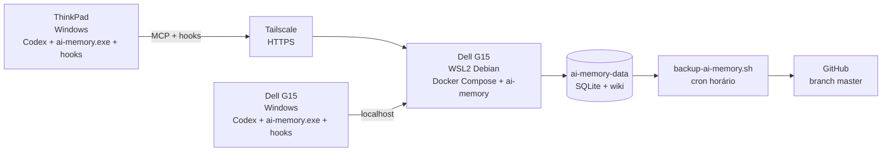

# ai-memory-wiki-backup

Backup e documentação do meu setup do ai-memory.

## Arquitetura



## Papéis

- **Dell G15 / WSL2:** servidor central do ai-memory.
- **Dell G15 / Windows:** cliente local do Codex.
- **ThinkPad / Windows:** cliente remoto do Codex.
- **GitHub / `master`:** backup automático da wiki.
- **GitHub / `setup`:** documentação da infraestrutura.

A base principal existe somente no G15.

O ThinkPad possui `ai-memory.exe`, hooks e integração com o Codex, mas não possui uma segunda base de memória.

## Atualização

A rotina normal é:

```text
G15 / WSL
  update-ai-memory.sh

G15 / PowerShell
  ai-memory upgrade

ThinkPad / PowerShell
  ai-memory upgrade
```

Veja [docs/update.md](docs/update.md).

## Instalação

Para recriar o ambiente do zero:

[docs/install.md](docs/install.md)

## Documentação

- [Arquitetura](docs/architecture.md)
- [G15](docs/g15.md)
- [ThinkPad](docs/thinkpad.md)
- [Projetos e escopos](docs/projects.md)
- [Instalação](docs/install.md)
- [Atualização](docs/update.md)

## Estrutura

```text
README.md

docs/
├── architecture.md
├── g15.md
├── thinkpad.md
├── projects.md
├── install.md
└── update.md

scripts/
├── backup-ai-memory.sh
└── update-ai-memory.sh
```

## Regras

1. Não faça alterações manuais na branch `master`.
2. Nunca versione tokens, senhas ou chaves privadas.
3. Nunca versione `AI_MEMORY_AUTH_TOKEN`.
4. Os `.ai-memory.toml` ficam locais em cada clone.
5. A branch `setup` contém somente documentação e scripts sem secrets.
